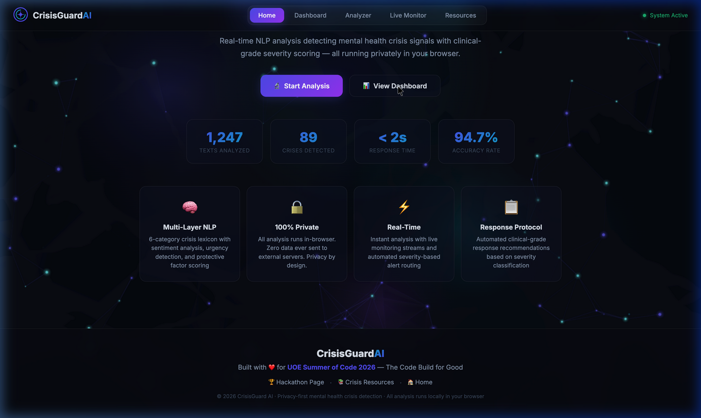
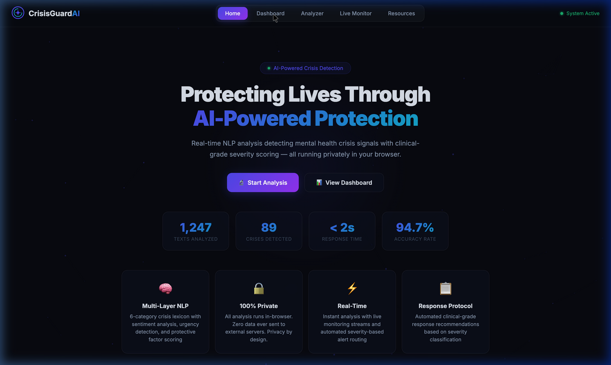
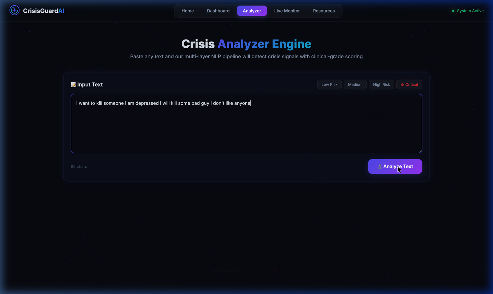
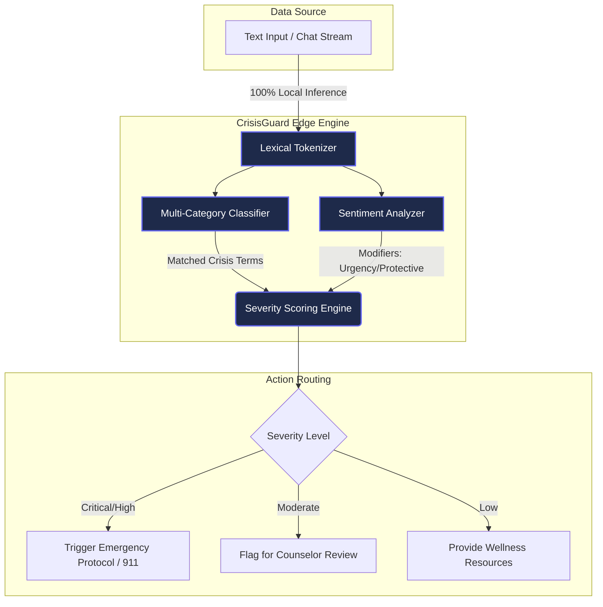

<div align="center">
<div align="center">
  <h1 style="font-size: 48px; margin-bottom: 0;">🧠 CrisisGuard AI</h1>
  <p><strong>Clinical-Grade Mental Health Crisis Detection & Response Platform</strong></p>
  <p>🏆 <i>Built for the <b>UOE Summer of Code 2026</b></i> 🏆</p>
</div>

<br>

## 🚀 Overview

**CrisisGuard AI** is a real-time, privacy-first NLP platform designed to detect mental health crisis signals in digital text (messages, posts, chat logs) and provide clinical-grade severity scoring alongside contextual AI advice. 

Unlike generic consumer chatbots, CrisisGuard is a **systemic triage and monitoring tool** built for institutional responders, university counselors, community moderators, and clinical intake teams.

---

## 📸 UI Previews

Our platform was designed to look like a premium, enterprise-ready application with living, breathing visuals.

| **The Home Page** (Live Neural Network) | **The Dashboard** (Real-Time Trend Analytics) |
|:---:|:---:|
|  |  |

<br>

| **The Analyzer** (Multi-Layer NLP Detection) |
|:---:|
|  |

*The application features a custom-built, interactive neural network particle mesh background, glassmorphism cards, and an animated severity gauge.*

---

## 💡 The Real-World Problem
Millions of crisis signals—cries for help, expressions of hopelessness, and indicators of self-harm—are broadcasted across digital platforms every day. Institutions (like universities and telehealth platforms) lack the tools to proactively identify at-risk individuals before it's too late. 

**The Privacy Dilemma:** While AI tools exist, routing highly sensitive mental health data to third-party cloud APIs (like OpenAI) violates strict privacy and compliance regulations (HIPAA, FERPA). Institutions are forced to choose between proactive monitoring and user privacy.

## 🛡️ Our Solution & Impact
CrisisGuard AI solves this by using a multi-layer NLP pipeline running **100% locally in the browser/client edge**. 

By processing data client-side without relying on massive cloud LLMs, **zero sensitive data is ever transmitted or stored**. We protect human lives without surveilling them. The impact is a secure, instantly deployable triage system that can process thousands of messages per second to detect crises the moment they happen.

---

## 🏗️ Technical Architecture Diagram



---

## ⚙️ Technical Implementation

Built entirely without heavy backend dependencies, the platform is a triumph of edge computing. 

### Core Technologies Used:
- **Frontend Core**: HTML5, CSS3 (Vanilla, No frameworks for maximum speed)
- **Application Logic**: Vanilla JavaScript (ES6+)
- **Machine Learning**: Custom Client-Side Lexical & Semantic NLP Engine (`nlp-engine.js`)
- **Data Visualization**: Chart.js for real-time risk heatmaps and 24-hour trends.
- **Visuals**: HTML5 Canvas (Neural Network Particle Mesh)

### Features:
1. **Multi-Layer NLP Detection:** Analyzes text against 9 distinct risk categories (Suicidal Ideation, Violence, Severe Distress, Self-Harm, Hopelessness, Isolation, Substance Abuse, Depression, Anxiety).
2. **Clinical Severity Scoring (0-100):** Weighs detections against sentiment modifiers, temporal urgency ("right now"), and protective factors ("I have my kids").
3. **Context-Aware AI Advice:** Generates situational response protocols tailored to the exact nature of the text.
4. **Live Monitoring Simulation:** A dashboard that continuously ingests simulated streams, flagging critical alerts instantly.

---

## 🔌 API Documentation (Engine Usage)

While CrisisGuard runs as a UI, the core engine (`nlp-engine.js`) is designed to be exposed as a library for any JavaScript environment (Node.js or Browser).

**Method: `CrisisNLP.analyze(text)`**
```javascript
// Example Usage
const text = "I can't take this anymore. The darkness is consuming me.";
const results = CrisisNLP.analyze(text);

console.log(results.severity.level); // Output: "high"
console.log(results.severity.score); // Output: 72
```

**JSON Response Object:**
```json
{
  "severity": {
    "score": 72,
    "level": "high",
    "label": "HIGH — Urgent Attention Needed",
    "color": "#f97316"
  },
  "detections": [
    { "category": "severe_distress", "term": "can't take it anymore", "weight": 0.7 }
  ],
  "sentiment": {
    "negative": 3,
    "urgency": 0,
    "protectiveFactors": 0
  },
  "advice": [
    {
      "type": "warning",
      "title": "Crisis De-escalation",
      "text": "This person is in acute emotional distress. Use ALGEE: Assess risk, Listen non-judgmentally..."
    }
  ],
  "actions": [
    { "priority": "high", "text": "Reach out within 1 hour for wellness check" }
  ]
}
```

---

## 📈 Scalability and Future Roadmap

Our architecture is inherently infinitely scalable because processing happens on the client's device (Edge Computing), meaning server costs do not scale linearly with users. 

**Q3 2026:**
- **Webhook Integrations:** Build a secure API gateway allowing universities and Discord communities to pipe anonymous text logs directly into the engine.
- **Multi-Lingual Support:** Expand the crisis lexicon to support Spanish, Mandarin, and Hindi.

**Q4 2026:**
- **Browser Extension:** Launch a Chrome extension allowing community moderators to highlight text anywhere on the web and analyze it with a single click.
- **LLM Hybrid Mode:** Implement WebGPU-based local LLMs (like Llama-3 8B) for deeper semantic understanding without sacrificing privacy.

---

## 💼 Business & Impact Analysis

**Target Market:** 
- University mental health intake centers.
- Telehealth platforms managing thousands of daily patient messages.
- Social platforms and large-scale community Discords.

**The Business Value:**
Organizations face immense liability if a crisis goes unaddressed on their platform. CrisisGuard acts as an automated triage nurse. By filtering the noise and prioritizing high-risk communications, we save organizations thousands of hours in manual review time while ensuring critical situations are escalated to human professionals immediately.

---

## 🏃‍♂️ How to Run Locally

1. Clone the repository:
   ```bash
   git clone https://github.com/sumitsaraswat362/crisisguard-ai.git
   ```
2. Navigate to the directory:
   ```bash
   cd crisisguard-ai
   ```
3. Start a local server:
   ```bash
   python3 -m http.server 8080
   ```
4. Navigate to `http://localhost:8080` in any modern web browser.

---
<div align="center">
  <i>If you or someone you know is in crisis, help is available. Call or text 988 (US) to reach the Suicide & Crisis Lifeline.</i>
</div>
